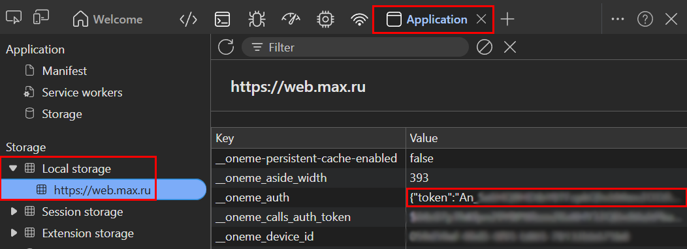

# Пересыльщик из MAX
Простой, однако очень удобный сервис, пересылающий сообщения из мессенджера MAX в Telegram и ВКонтакте


## Как работает:
**1. Получаете токен аккаунта в MAX**  
Через этот токен будут отслеживаться новые сообщения, приходящие на аккаунт в MAX  
**2. Создаёте бота в Telegram или ВКонтакте и получаете их токены**  
Через этих ботов будут отправляться сообщения из MAX в эти групповые чаты этих мессенджеров
**3. Запускаете сервис с указанными токенами**  
**4. Отправляете инвайт-ссылку в чат в MAX созданному боту в ином мессенджере**  
В ответ бот отправляет специальный код для привязки чата в MAX к групповому чату в ином мессенджере  
**5. Создаёте в Telegram или ВКонтакте группу и добавляете туда бота (или добавляете в уже существующую группу**  
**6. Отправляете код из пункта 4 в группу в Telegram или ВКонтакте**  
Готово! Теперь все сообщения, приходящие в подключённый чат в MAX, будут пересылаться в привязанный групповой чат в Telegram или ВКонтакте


## Как развернуть это у себя:
**1. Установите Python 3.10 или выше**  
**2. Скачайте код с GitHub и распакуйте его**  
Или клонируйте репозиторий:
```bash
git clone https://github.com/yakushinvl/resendmax.git
```
**3. Установите зависимости:**
```bash
pip install -r requirements.txt
```
**4. Настройте файл окружения `.env` с токенами и другими параметрами**
```dotenv
MAX_PHONE=Номер телефона аккаунта в формате +7XXXXXXXXXX
MAX_TOKEN=Токен аккаунта (инструкция получения в README.md)
TG_TOKEN=Токен бота Telegram
VK_TOKEN=Токен бота ВКонтакте
VK_USER_TOKEN=Токен пользователя ВКонтакте (необходим для загрузки видео)
```
**5. Запустите сервис:**
```bash
python main.py
```

## Как получить токен аккаунта в MAX:
1. Откройте веб-версию MAX: https://web.max.ru
2. Откройте Devtools в браузере (F12 или Ctrl+Shift+I)
3. Перейдите на вкладку "Application" (Приложение)
4. В левом меню выберите "Local storage" и найдите переменную под ключом `__oneme_auth`
5. Скопируйте значение `"token"` этой переменной и вставьте его в файл окружения `.env` в строку `MAX_TOKEN`  

  

Значение переменной `__oneme_auth` выглядит примерно так:
```json
{"token":"An_REALLY_5ECRET-T0KEN_MAX","viewerId":1234567}
```

## Важно:
Создатель репозитория не несёт ответственности за возможные последствия использования данного сервиса, включая, но не ограничиваясь, блокировкой аккаунта в MAX или других мессенджерах. Используйте данный сервис на свой страх и риск


## Планируемые обновления:
- [ ] Поддержка опросов (создание своих в Telegram и ВКонтакте без синхронизации голосов)
- [ ] Юзербот скрипт для полноценной пересылки из MAX (всех чатов, с возможностью ответить)


## Поднятый сервис: 
Для удобства ~~ленивых~~ с ограниченным желанием работать пользователей, создан публичный экземпляр сервиса, который можно использовать без установки и настройки. Просто отправьте инвайт-ссылку в чат в MAX боту в Telegram или ВКонтакте, и он пришлёт вам код для привязки чата в MAX к групповому чату в Telegram или ВКонтакте
- **Telegram:** https://t.me/resendmax_bot
- **ВКонтакте:** https://vk.com/resendmax